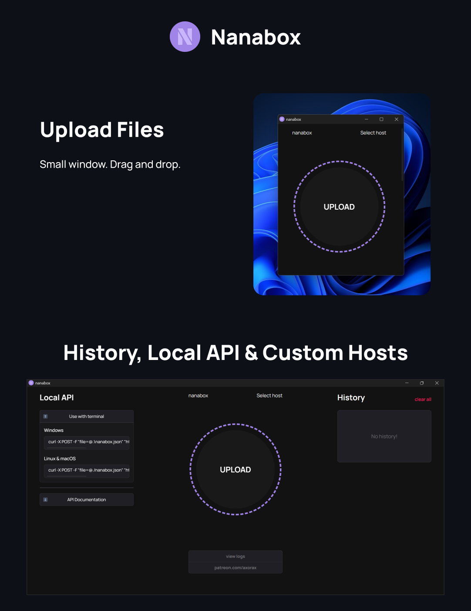

<p align="center">
    
</p>

## ✨ · Installation

### 💻 — Executable file:

1. Go to https://github.com/Axorax/nanabox/releases

2. Download a file according to your operating system.

### 🐍 — With Python:

1. Download the source code or run (in terminal):

```
git clone https://github.com/Axorax/nanabox.git
```

2. Change directory:

```
cd nanabox
```

3. Install Python dependencies:

```
pip install -r requirements.txt
```

4. Install JavaScript dependencies:

```
npm install
```

5. Run the app in dev mode:

```sh
npm run dev
```

## ❎ · File not uploading!

> [!IMPORTANT]
> Nanabox uses other free third-party APIs to store the uploaded files. This does mean that the providers can use your uploaded content in any way they want so make sure to read their terms. You can change the API being used by clicking on `Select host` and changing it. Sometimes the APIs may go down then it won't work. You can also add your own API. For adding your own API, you need to provide a path that leads to the URL for the uploaded file in the JSON response, this is lambda. An example of it can be `lambda data: data['link']`


---

<p align="center"><a href="https://www.patreon.com/axorax">Support me on Patreon</a> — <a href="https://github.com/axorax/socials">Check out my socials</a></p>
